# 🤖 Robotic Manipulator Kinematics Analysis Platform


A comprehensive desktop application for forward and inverse kinematics analysis of industrial robotic manipulators (UR5, ABB IRB 1600, KUKA KR16), featuring both symbolic and numeric computation modes with interactive 3D visualization.

---


---

## 📋 Table of Contents

- [Features](#-features)
- [Supported Robot Models](#-supported-robot-models)
- [Installation](#-installation)
- [User Guide](#-user-guide)
- [Technical Details](#-technical-details)
- [Makefile Commands](#-makefile-commands)
- [Contributors](#-contributors)
- [Contact and support](#-contact-and-support)
- [Citation](#-citation)
- [License](#-license)
- [Comprehensive Documentation](#-comprehensive-documentation)
- [Acknowledgments](#-acknowledgments)

---

## ✨ Features

### Core Functionality

#### Forward Kinematics (FK)
- **Numeric Mode**: Calculate end-effector pose from joint angles
- **Symbolic Mode**: Generate symbolic transformation matrices with joint variables
- **Frame Selection**: Display all frames or select specific range (Frame 0 to Frame 6)
- **Individual & Cumulative Transformations**: View both link-to-link and base-to-frame transformations

#### Inverse Kinematics (IK)
- **Closed-Form Solutions**: Analytical IK for all supported robots, leveraging geometric kinematic decoupling to separate the positioning problem (first three joints) from the orientation problem (wrist joints).
- **Multiple Solutions**: Find all valid configurations (up to 8 solutions per target)
- **Symbolic Derivation**: Step-by-step symbolic solution with detailed explanation
- **Two Input Methods**:
  - Position & Orientation (x, y, z, α, β, γ)
  - 4×4 Homogeneous Transformation Matrix

<!-- <video src="readme_srcs/forward_kinematics.mp4" width="800"></video>
<video src="readme_srcs/inverse_kinematics.mp4" width="800"></video> -->


https://github.com/user-attachments/assets/a080c655-02f5-476e-8a5e-5a8307a356ca


https://github.com/user-attachments/assets/92b728af-ef8a-4c09-a745-8aa91d42be6d


### Visualization

#### 3D CAD Viewer
- Interactive OpenGL-based 3D model viewer
- Smooth rotation with momentum-based controls
- Preset views: Isometric, Top, Front, Side
- Custom view controls with elevation and azimuth
- Zoom controls with smooth animation
- Display options:
  - Show/Hide edges
  - Wireframe mode
  - Coordinate axes indicator

#### 2D Technical Drawings
- DH parameter diagrams for each robot
- Cross-sectional views and technical specifications
- High-quality engineering drawings

<!-- <video src="readme_srcs/visualization.mp4" width="800"></video> -->


https://github.com/user-attachments/assets/c88eaf2f-2a25-4226-9889-15318be613ed


### User Interface

- **Professional Layout**: Clean, organized tabbed interface
- **Real-time Updates**: All calculations update instantly
- **Unit Conversion**: Switch between radians and degrees
- **DH Parameter Table**: Interactive table with automatic population
- **Color-coded Outputs**: Visual distinction between position/orientation components

---

## 🤖 Supported Robot Models

### 1. Universal Robots UR5
- **Type**: 6-DOF Industrial Collaborative Robot
- **Reach**: 850mm
- **Payload**: 5 kg
- **Configuration**: All revolute joints
- **DH Convention**: Modified DH parameters
- **Applications**: Assembly, pick-and-place, machine tending, quality inspection, and packaging

<p align="center">
  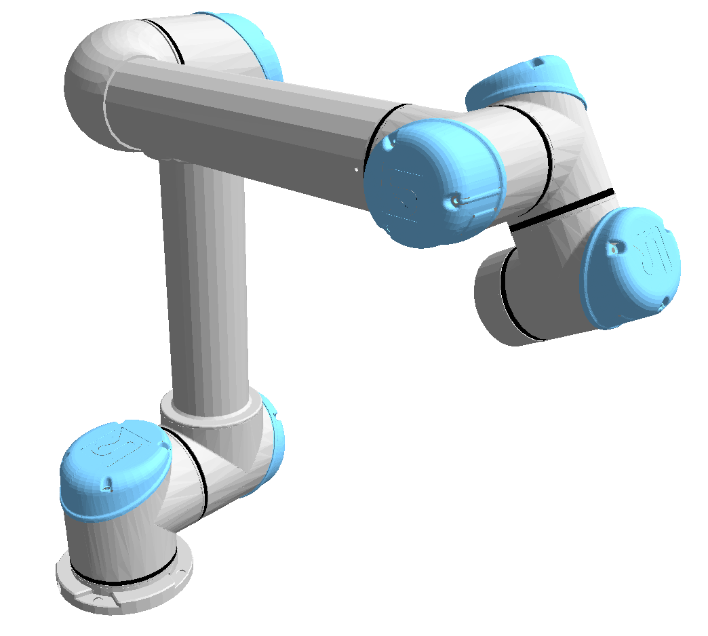
  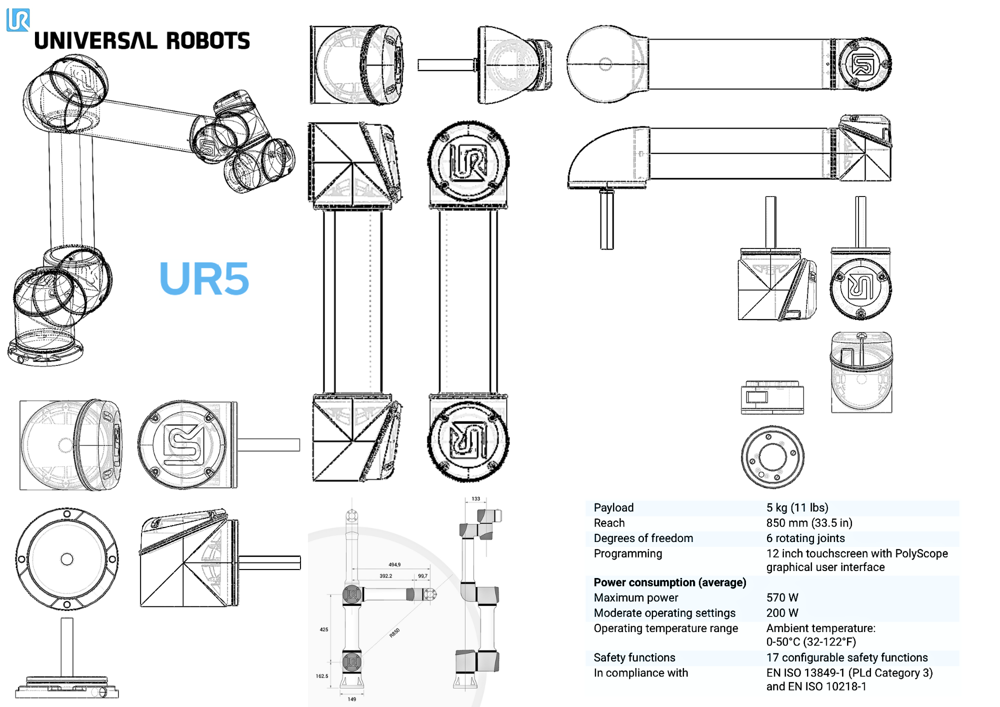
</p>

### 2. ABB IRB 1600
- **Type**: 6-DOF Industrial Robot
- **Reach**: 1450mm 
- **Payload**: 10 kg
- **Configuration**: All revolute joints
- **Workspace**: Large working envelope
- **Applications**: Material handling, arc welding, machine loading and unloading, palletizing, and assembly

<p align="center">
  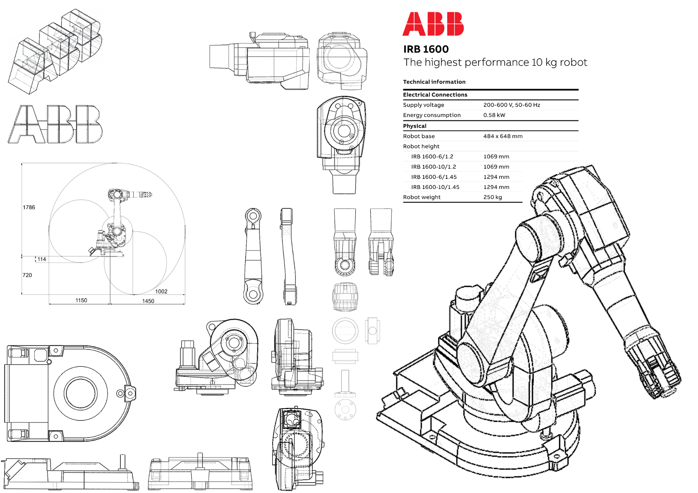
  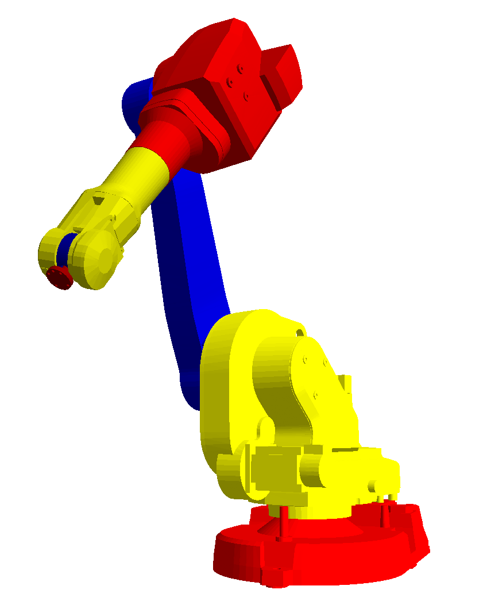
</p>

### 3. KUKA KR16
- **Type**: 6-DOF Industrial Robot
- **Reach**: 2013 mm
- **Payload**: 16 kg
- **Configuration**: All revolute joints
- **Applications**: Spot welding, assembly, material handling, packaging, and quality inspection

<p align="center">
  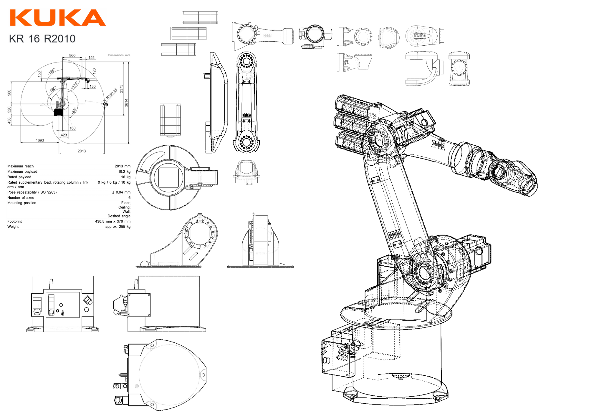
  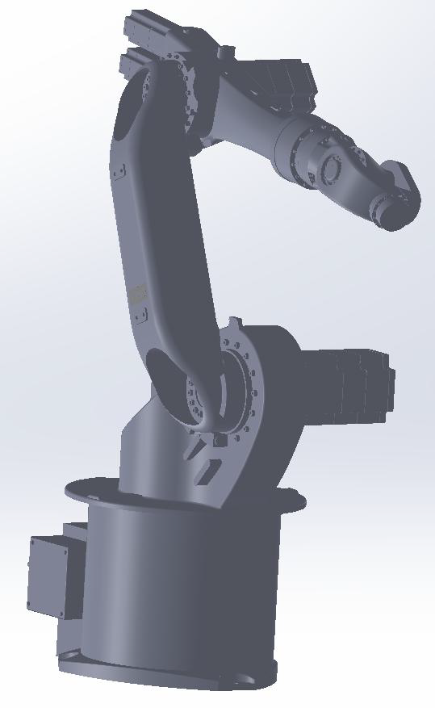
</p>

## 🚀 Installation

1. **Clone or Download the Repository**
   ```bash
   git clone <repository-url>
   cd Robotic_Manipulator_Kinematics_Analysis_Platform
   ```

2. **Run Setup with Make**
   ```bash
   make venv    # Create virtual environment
   make install # Install dependencies
   make run     # Launch application
   ```

   Or use the all-in-one command:
   ```bash
   make all
   ```

### Manual Installation (Without Make)

If Make is not working:

```bash

# Linux/wsl
python3 -m venv .venv
source .venv/bin/activate
pip install --upgrade pip
pip install -r requirements.txt
python main.py
```

---

### Running the Application

Using Make (recommended):
```bash
make run
```

Or directly with Python:
```bash
# Activate virtual environment first
# Windows:
.venv\Scripts\activate

# Linux/macOS:
source .venv/bin/activate

# Then run:
python main.py
```

### Basic Workflow

1. **Select Robot**: Choose from UR5, ABB IRB 1600, or KUKA KR16
2. **Choose Mode**: Forward Kinematics (FK) or Inverse Kinematics (IK)
3. **Select Computation**: Symbolic or Numeric
4. **Enter Input**: Joint values (FK) or target pose (IK)
5. **Calculate**: Click the "Calculate" button
6. **View Results**: Check the "Outputs" tab for detailed results
7. **Visualize**: Switch to "3D CAD Model" tab for 3D visualization and  "2D Sections" tab to see the 2D sections of the selected manipulator.

---

## 📖 User Guide

### Tab 1: Inputs


<p align="center">
  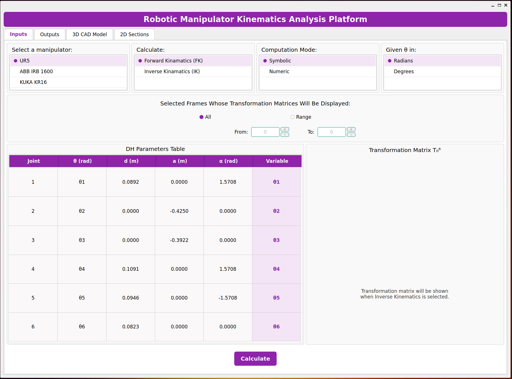
</p>


#### Robot Selection
- Use the **"Select a manipulator"** list to choose your robot
- The DH parameters table updates automatically

#### Calculation Type
- **Forward Kinematics (FK)**: Calculate end-effector pose from joint angles
- **Inverse Kinematics (IK)**: Calculate joint angles for desired end-effector pose

#### Computation Mode
- **Symbolic**: Shows mathematical expressions and relationships
- **Numeric**: Computes actual numerical values

#### Angle Units
- **Radians**: Standard mathematical unit (default for calculations)
- **Degrees**: More intuitive for engineering applications
- Note: All angles are stored internally in radians

#### DH Parameters Table
- **Fixed Parameters**: θ, d, a, α (grayed out cells)
- **Variable Column**: Shows which parameter is the joint variable (θᵢ or dᵢ)
- **Value Column**: Enter joint values here (only in Numeric FK mode)

#### Forward Kinematics Options
- **All Frames**: Display transformations for all frames (0→1, 0→2, ..., 0→6)
- **Range**: Select specific frame range using From/To spinboxes

#### Inverse Kinematics Input Methods

**Method 1: Position & Orientation**
- Enter X, Y, Z coordinates (meters)
- Enter Roll (α), Pitch (β), Yaw (γ) angles
- Convention: ZYX Euler angles

<p align="center">
  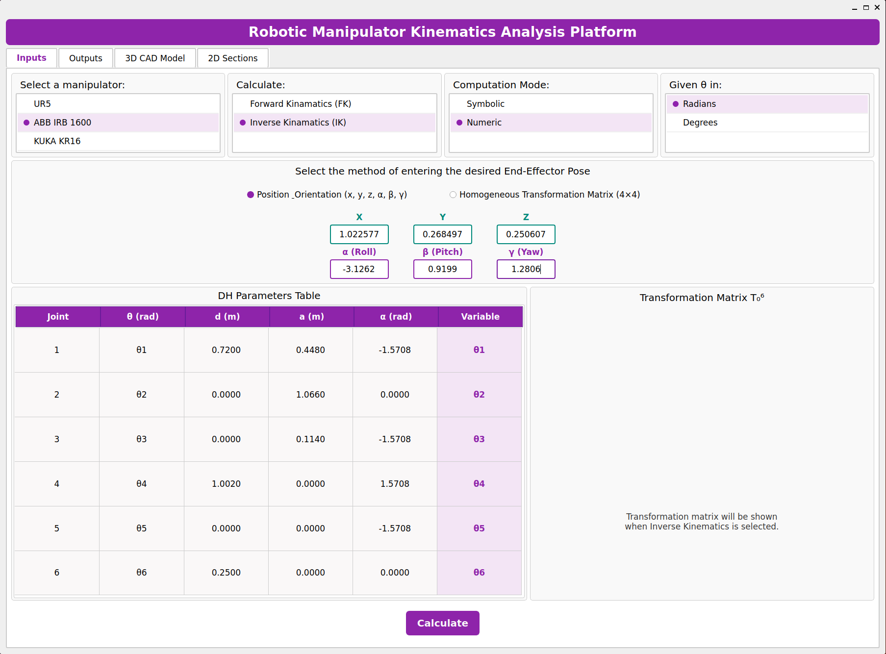
</p>

**Method 2: Transformation Matrix**
- Enter full 4×4 homogeneous transformation matrix
- Rotation part (3×3, top-left)
- Translation part (3×1, top-right)
- Homogeneous row [0, 0, 0, 1]

<p align="center">
  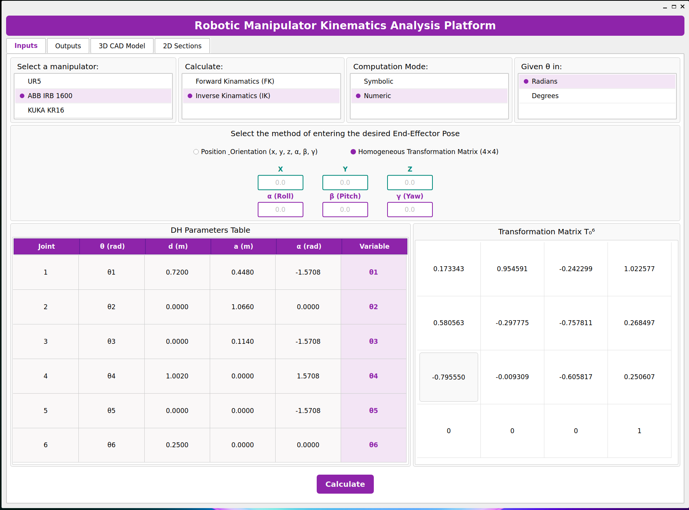
</p>

### Tab 2: Outputs

#### Result Display Sections

**Forward Kinematics Results**
1. **Input Joint Values**: Color-coded display of entered joint angles/positions
2. **Individual Link Transformations**: Transformation from frame i to frame i+1
3. **Cumulative Transformations**: Transformation from base (frame 0) to frame i
4. **End-Effector Pose**: Final position and orientation
   - Position in X, Y, Z (meters)
   - Orientation in Roll, Pitch, Yaw

<p align="center">
  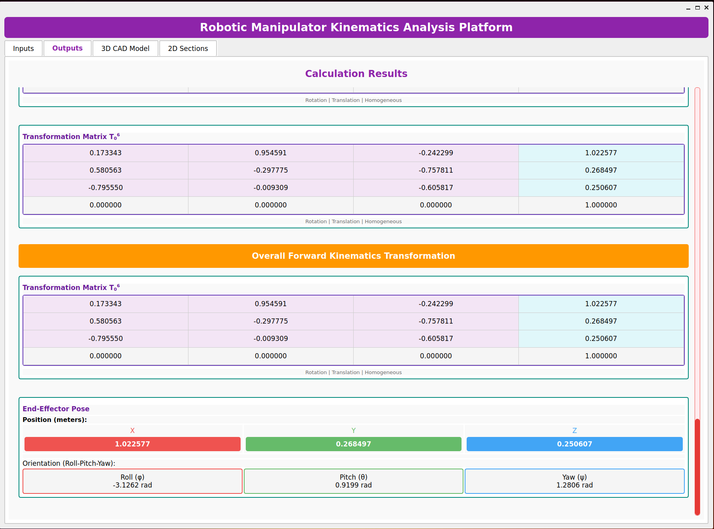
  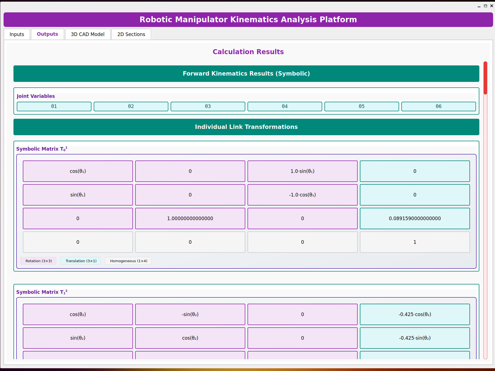
</p>

**Inverse Kinematics Results**
1. **Target Pose**: Input transformation matrix and pose breakdown
2. **Solution Count**: Number of valid configurations found
3. **Individual Solutions**: Each solution shows:
   - All 6 joint angles
   - Validation status (✓ or ⚠)
   - FK verification error

<p align="center">
  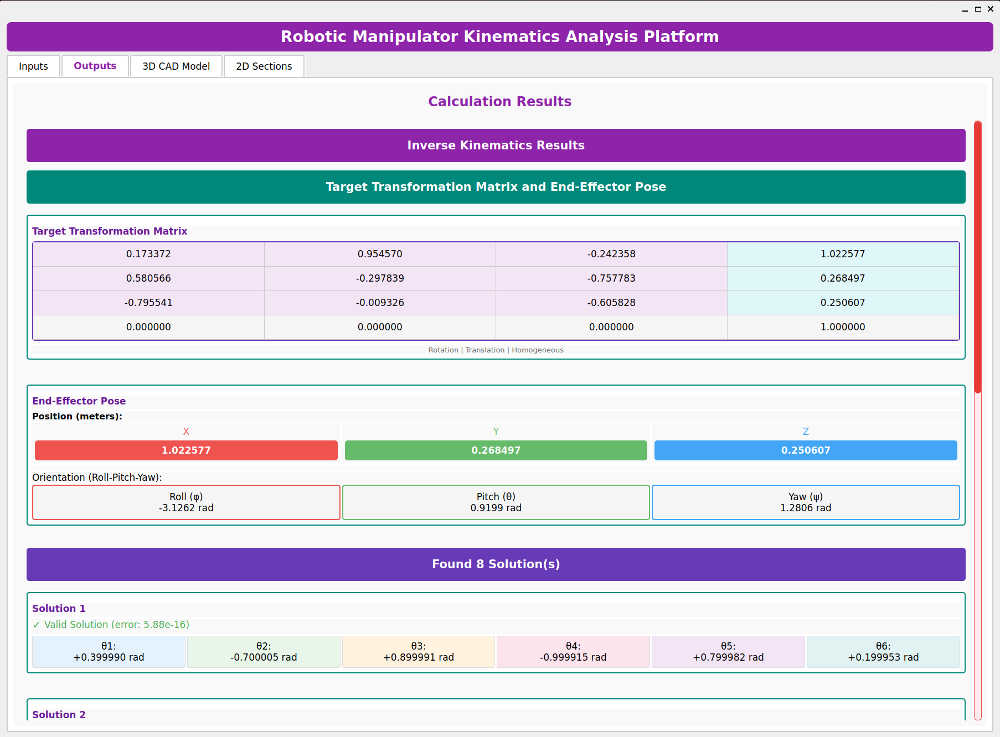
  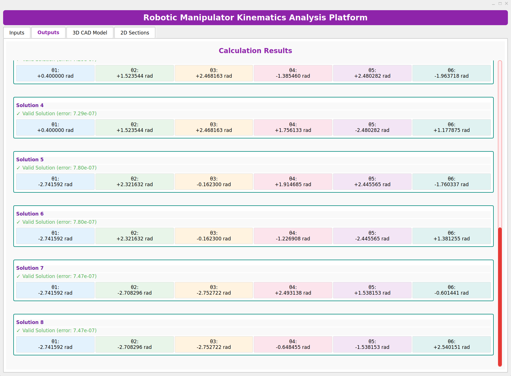
</p>


4. **Symbolic Derivation** (Symbolic mode):
   - Step-by-step solution procedure
   - Wrist center calculation
   - Joint angle derivations
   - Solution branches explanation

<p align="center">
  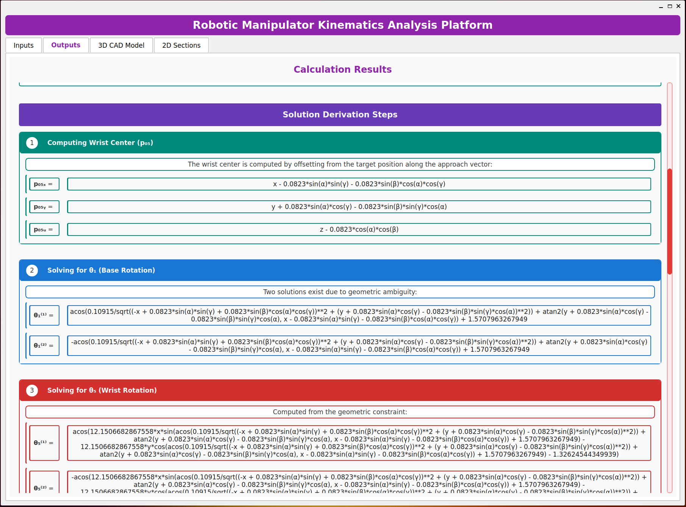
</p>


### Tab 3: 3D CAD Model
<!-- <video src="readme_srcs/visualization.mp4" width="800"></video> -->
 
 
 - The DH parameter reference diagrams showing frame assignments for the manipulator are presented in this Tab

#### Model Controls
- **Mouse Controls**:
  - Left-click + Drag: Rotate model
  - Right-click + Drag: Zoom
  - Scroll Wheel: Zoom in/out
  - Smooth momentum-based rotation

#### View Presets
- **Isometric**: 35° elevation, 45° azimuth (default engineering view)
- **Top**: Bird's eye view (90° elevation)
- **Front**: Straight-on view (0° elevation, 0° azimuth)
- **Side**: Side profile (0° elevation, 90° azimuth)

#### Custom View
- **Elevation**: Vertical angle (-180° to +180°)
- **Azimuth**: Horizontal rotation (-180° to +180°)
- Use + / - buttons or enter values directly

#### Display Options
- **Show Edges**: Highlight mesh edges (black wireframe overlay)
- **Wireframe Mode**: Show only edges (no filled surfaces)
- **Show Coordinate Axes**: Display X-Y-Z axes indicator in corner
  - Red: X-axis
  - Green: Y-axis
  - Blue: Z-axis

### Tab 4: 2D Sections
- View engineering drawings
- Technical cross-sections for each robot

---

## 🔧 Technical Details

### Denavit-Hartenberg (DH) Convention

The application uses **Standard DH Convention** with parameters:
- **θ (theta)**: Joint angle around Z-axis
- **d**: Link offset along Z-axis
- **a**: Link length along X-axis
- **α (alpha)**: Link twist around X-axis

Transformation matrix formula:
```
T = [ cos(θ)  -sin(θ)cos(α)   sin(θ)sin(α)   a·cos(θ) ]
    [ sin(θ)   cos(θ)cos(α)  -cos(θ)sin(α)   a·sin(θ) ]
    [   0         sin(α)          cos(α)         d    ]
    [   0           0               0            1    ]
```

### Inverse Kinematics Algorithm

**Method**: Closed-form analytical solution for 6R manipulators with spherical wrist

**Solution Strategy**:
1. **Wrist Center Calculation**: p₀₅ = p₀₆ - d₆·R₀₆[:, 2]
2. **First Three Joints** (Position): Geometric solution for shoulder and elbow
3. **Last Three Joints** (Orientation): Euler angle extraction from rotation matrix

**Solution Branches**:
- θ₁: 2 solutions (shoulder left/right)
- θ₃: 2 solutions (elbow up/down)
- θ₅: 2 solutions (wrist flip)
- **Total**: Up to 8 unique configurations

**Verification**: Each solution is verified using forward kinematics

### Coordinate Systems

- **Base Frame**: World coordinate system at robot base
- **End-Effector Frame**: Tool center point (TCP)
- **Euler Angles**: ZYX convention (Yaw-Pitch-Roll)
  - Roll (α): Rotation around X-axis
  - Pitch (β): Rotation around Y-axis
  - Yaw (γ): Rotation around Z-axis

---

## 🛠️ Makefile Commands

The Makefile provides cross-platform automation:

```bash
make venv      # Create virtual environment
make install   # Install Python dependencies
make run       # Launch the application
make clean     # Remove cache files (__pycache__)
make fclean    # Remove virtual environment + cache
make re        # Clean rebuild (fclean + venv + install)
make all       # Full setup and run (default)
```

**Note**: The Makefile automatically detects your operating system (Windows, Linux, macOS) and uses appropriate commands.

---

## 👥 Contributors
Note: This project was developed as part of academic coursework under the Robotic Systems Course given by Professor Zaer Abu Hammour
at the mechatronics engineering department at the University of Jordan in the First Semester of the academic year of 2025/2026 by:

- Meera Qasem Shersheer : GUI Development, System Integration and Visualization

- Rama Fathi Haddad : Kinematics Algorithm Development & Analytical Modeling

- Own Mathhar Al-Mazahreh : CAD Modeling & Mechanical Representation


---
## 📧 Contact and support
For questions or feedback about this project, please contact:
 Meera Shersheer - [meera04qasemshersheer@gmail.com]

---

## 📚 Citation
If you use this project in your research or academic work, please cite:
bibtex@software{robotics_kinematics_2025,
  title = {Robotic Manipulator Kinematics Analysis Platform},
  author = {Shersheer, Meera and Haddad, Rama and Al-Mazahreh, Own},
  year = {2025},
  note = {Course Project for Robotic Systems, First Semester 2025/2026},
  instructor = {Prof. Zaer Abu Hammour},
  institution = {University of Jordan},
  copyright = {All Rights Reserved}
}

---
## 📄 License

**Copyright (c) 2025 Meera Qasem Shersheer, Rama Fathi Haddad, Own Mathhar Al-Mazahreh. All Rights Reserved.**

This software and associated documentation files are proprietary and closed-source. It was developed as part of academic coursework for the Robotic Systems course at the Mechatronics Engineering Department, University of Jordan. 

No part of this Software may be reproduced, distributed, or transmitted in any form or by any means without the prior written permission of the copyright holders.

For full legal details and permission requests, please refer to the **[LICENSE.txt](./LICENSE.txt)** file included in this repository.

---

## 📄 Comprehensive Documentation

For an in-depth understanding of the mathematical framework, including step-by-step analytical inverse kinematics derivations, full Denavit-Hartenberg parameter breakdowns, and numerical validation data, please refer to our complete project report:

**[Read the Full Documentation PDF](./Robotics_project_G05_pdf.pdf)**

---
## Acknowledgments
We thank the open-source community for the excellent libraries used in this project

---

**Enjoy exploring robotic kinematics!✨**
